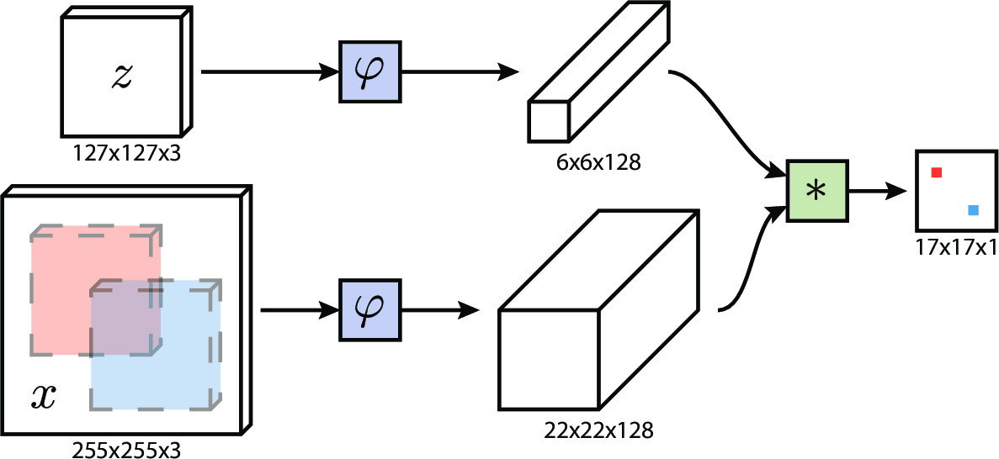

# ML Template Matching

This project is Python/Tensorflow implementation of the Siamese Network at https://arxiv.org/abs/1606.09549, used to solve Template Matching problem with  a Machine Learning approach.
Template matchingis a technique in digital image processing for finding small parts of an image which match a template image (https://en.wikipedia.org/wiki/Template_matching).

## Architecture



## Environment
Python 3
TensorFlow 2
Matplotlib 

## Running 
```
python main.py <mode> <data_path>
```

mode:
  - train to run training.
  - test to run prediction.
  - dataset path.
  
## Training
COCO Dataset (https://cocodataset.org/#home) has been used as Training Set.
In the preprocessing pipeline a random crop is taken from a target image to build a couple (Image, Target) to feed the input of the Siamese Network.
  
## Implementation Details
  
I built this project using TensorFlow.
I implemented on my own network's layer using TensorFlow low-level api, and used a custom training loop

## Improvement

I built the same model using tf.Function api to obtain better training performances (https://www.tensorflow.org/guide/function).
More details at https://github.com/alessiodiluzio/MLOptimizedTemplateMatching
